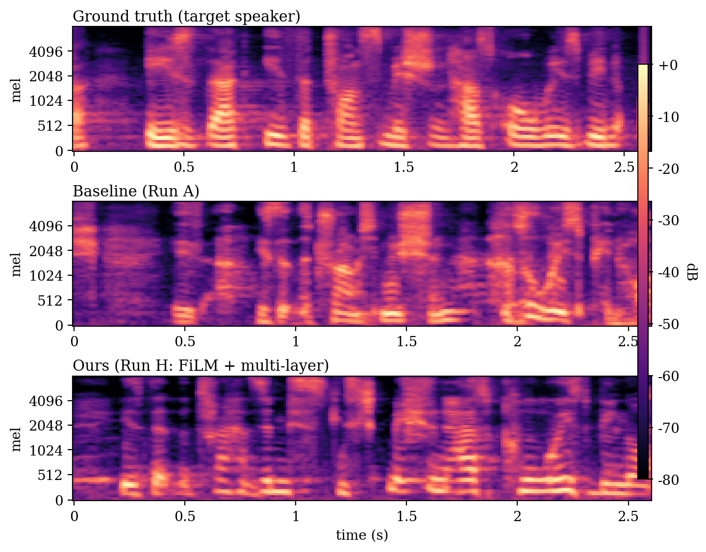

# lip-to-voice

Speaker-conditioned lip-to-speech: synthesize a talker's **own voice** from silent video.

Built on [LipVoicer](https://github.com/yochaiye/LipVoicer) (diffusion-based lip-to-speech, ICLR 2024). LipVoicer recovers *what* was said from lip movements, but the generated voice is generic. This project adds *who* is speaking: speaker identity — from a frozen ECAPA-TDNN audio embedding plus a learned face-based visual style encoder — is injected into the frozen diffusion denoiser via FiLM (feature-wise linear modulation) at every residual layer, without touching any pretrained weights.



## Method

The base pipeline: a lip-reading network extracts per-frame visual features, a WaveNet-style diffusion denoiser generates mel-spectrograms under classifier guidance from a conformer ASR, and HiFi-GAN vocodes to 16 kHz audio. All pretrained components stay frozen; only the new modules train (6k steps, contrastive InfoNCE auxiliary loss for speaker identity).

New modules (in `models/`):

- `temporal_attention.py` — pre-LN ReZero transformer over lip features
- `flow_model.py` — RAFT optical-flow encoder with zero-init gated fusion
- `speaker_style.py` — visual style encoder (face only, mouth excluded so it cannot leak phonetic content) + ReZero speaker fusion
- `speaker_style_film.py` — FiLM speaker fusion + a per-layer FiLM bank that modulates all 12 denoiser residual blocks through forward hooks
- `audiovisual_{flow,full,spk,spk_film}_model.py` — top-level models combining the above with the frozen backbone

Every module is identity-initialized, so each model is provably equal to the baseline at step 0 — verified numerically by `check_invariance` before any training run.

## Ablation runs

One variant key selects the model everywhere (`--variant`):

| Variant    | Run | Adds                                    |
|------------|-----|-----------------------------------------|
| `a`        | A   | nothing (pretrained baseline)           |
| `b`        | B   | temporal attention                      |
| `c`        | C   | optical-flow stream                     |
| `d`        | D   | flow + attention                        |
| `spk`      | E   | speaker/style fusion (ReZero)           |
| `spk_attn` | F   | E + attention                           |
| `g`        | G   | FiLM speaker fusion + per-layer FiLM    |
| `h`        | H   | G + attention (best)                    |

## Setup

Everything runs on [Modal](https://modal.com) (serverless GPUs) against one persistent volume; nothing computes locally.

```bash
pip install modal
modal token new
modal secret create huggingface HF_TOKEN=<your_token>   # for checkpoint downloads
```

## Data pipeline

The training corpus is built from scratch: 7,945 sentence-level clips from 295 public TED talks, split by talk so no speaker appears in both train and eval.

```bash
modal run modal_app.py --step fetch_ted_list
modal run modal_app.py --step download_ted
modal run modal_app.py --step orchestrate_remainder      # segment -> mouth ROIs -> mels -> manifest
modal run modal_app.py --step precompute_flow            # runs c, d
modal run modal_app.py --step select_reference_clips     # runs spk..h
modal run modal_app.py --step precompute_speaker_embeddings
```

## Train / evaluate

Example: the headline run (H).

```bash
modal run modal_app.py --step check_invariance --variant h
modal run --detach modal_app.py --step train_speaker --variant h
modal run --detach modal_app.py --step infer_speaker --variant h
modal run modal_app.py --step eval_ted --variant h            # WER / STOI / DNSMOS
modal run modal_app.py --step eval_speaker_sim --variant h    # ECAPA cosine similarity
modal run --detach modal_app.py --step swap_test_generate --variant h
modal run modal_app.py --step swap_test_score --variant h     # cross-speaker disentanglement
```

Runs B–D use `train_ablation` / `infer_ablation` with `--variant b|c|d`. Metric JSONs land in `/vol/results/`. Run with no `--step` to list every available step.

## Acknowledgements

Upstream code and pretrained checkpoints from [LipVoicer](https://github.com/yochaiye/LipVoicer) (Yemini et al., ICLR 2024); the original modules (`ASR/`, `hifi_gan/`, `mouthroi_processing/`, `dataloaders/`, `models/` backbone) are preserved at the repository root. Speaker embeddings from [SpeechBrain](https://speechbrain.github.io) ECAPA-TDNN. See `LICENSE`.
